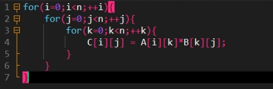

<<<<<<< HEAD
# 一、并行技术路线：

1、通信优化：

（1）矩阵的存储为二维数组，如果要对二维数组进行通信，每次只能通信一行数据，那么一个n×n阶矩阵就需要通信n次，我们可以选择将二维数组降维成一维数组，这样就只需要进行一次通信即可。

（2）高阶矩阵计算涉及到大量的数据，因此，每次通信的时候不要选择将所有数据都进行通信，而是将目标进程需要的数据进行通信即可。

2、内存优化：

（1）矩阵的维度并不确定，因此我们选择动态开辟矩阵的内存空间，避免空间浪费。

（2）并行程序中，并不是所有的进程都需要某个数据的存储空间，比如，我们在计算U矩阵的逆矩阵时，并不是所有的矩阵都需要U逆矩阵这个n×n大小的存储空间，只有主进程需要开辟这个大小的空间，子进程只需要开辟分配给它任务计算量的内存空间即可。我们根据进程的需求对内存空间进行开辟。

3、算法优化：

（1）第一处优化的地方是对于LU矩阵计算的优化。

（2）第二处优化是并行矩阵乘法算法。

4、IO优化：数据的生成是采用随机数生成在.txt文档中的，那么进行数据读取	的时候必然会涉及到文件读取操作，但是大量且频繁的IO读取操作会让效率变得	非常慢，这时候考虑到了两种方式。

（1）一种是通过fread函数一次性将文件中所有数据读取到缓冲区，然后对	缓冲区中的数据进行格式提取。

（2）另外一种是通过内存映射的方式，直接将文件映射到进程的内存空间	中，让进程可以像访问内存一样访问文件中的数据，考虑到内存映射可以避免频	繁IO操作，且同一个文件可以映射到多个进程的内存空间中，从而实现进程之间	的数据共享，可以避免复制数据的开销，提高效率。同时还可以直接用指针来读	写文件数据，无需调用read和write等系统调用，所以我们选择用内存映射的方	式来对数据进行读取。

5、运算流程优化：为了尽可能的将所有进程利用起来，运算流程的优化是可以显著提高程序的运算速度。并行程序的运算流程如下图：

​                                                               

​									                                                        图1 并行程序运算流程图

6、 并行程序测试：

（1）测试小数据集：在测试MPI并行程序的时候，先使用多种小数据集来对程序的正确性进行测试。

（2）测试大数据集：确认了程序的正确性以后，通过测试1000-10000阶的矩阵来验证程序的运行速度和上限。

# 二、算法分析

1、矩阵乘法的优化，一般使用的矩阵乘法是这样的：

​                                                           

​                                                                                           图2 常见的矩阵乘法算法

​	这种方式常见，但是计算速度太低，算法复杂度是O(n3)，主要缺点在于对于内存的访问效率过低，B[k][j]中数据的读取，是不连续的，随着k不断加1，B[k][j]不断的在内存中跳跃，这会引起缓存命中率低，程序不断把内存转移至缓存，因此效率降低。我们在进行矩阵乘法的时候，从缓存命中率和程序的局部性原理来优化了这个步骤，算法复杂度虽然仍然是O(n3)，但是计算效率大大提高。   

​                                                          

​                                                                                            图3 优化的矩阵乘法算法 

​	最内层的循环，随着j加1，C[i][j]和B[k][j]都是每次只加1，这符合空间局部性的原理，也就是说，内存每次读取都是一个接着一个来的，没有大幅度跳跃，其次，A[i][k]在中间层的循环是跳跃的，但是中间层的执行没有底层那么多，所以我们将其赋值给了局部变量tmp，在编译器生成汇编代码的过程中，局部变量tmp应该由CPU寄存器存储，最底层循环程序读取寄存器的时间几乎可以忽略不计。

2、并行矩阵乘法算法

​	并行矩阵乘法算法，在这里我们将U逆矩阵根据行数，均分给	各个进程，每个进程得到自己的行数据以后，就和L逆矩阵进行相乘，最后聚集各个进	程的计算结果，就可以得到最终结果。并行矩阵乘法算法是在串行矩阵乘法算法的基础	上进行改进。

=======
<<<<<<< HEAD
# 一、并行技术路线：

1、通信优化：

（1）矩阵的存储为二维数组，如果要对二维数组进行通信，每次只能通信一行数据，那么一个n×n阶矩阵就需要通信n次，我们可以选择将二维数组降维成一维数组，这样就只需要进行一次通信即可。

（2）高阶矩阵计算涉及到大量的数据，因此，每次通信的时候不要选择将所有数据都进行通信，而是将目标进程需要的数据进行通信即可。

2、内存优化：

（1）矩阵的维度并不确定，因此我们选择动态开辟矩阵的内存空间，避免空间浪费。

（2）并行程序中，并不是所有的进程都需要某个数据的存储空间，比如，我们在计算U矩阵的逆矩阵时，并不是所有的矩阵都需要U逆矩阵这个n×n大小的存储空间，只有主进程需要开辟这个大小的空间，子进程只需要开辟分配给它任务计算量的内存空间即可。我们根据进程的需求对内存空间进行开辟。

3、算法优化：

（1）第一处优化的地方是对于LU矩阵计算的优化。

（2）第二处优化是并行矩阵乘法算法。

4、IO优化：数据的生成是采用随机数生成在.txt文档中的，那么进行数据读取	的时候必然会涉及到文件读取操作，但是大量且频繁的IO读取操作会让效率变得	非常慢，这时候考虑到了两种方式。

（1）一种是通过fread函数一次性将文件中所有数据读取到缓冲区，然后对	缓冲区中的数据进行格式提取。

（2）另外一种是通过内存映射的方式，直接将文件映射到进程的内存空间	中，让进程可以像访问内存一样访问文件中的数据，考虑到内存映射可以避免频	繁IO操作，且同一个文件可以映射到多个进程的内存空间中，从而实现进程之间	的数据共享，可以避免复制数据的开销，提高效率。同时还可以直接用指针来读	写文件数据，无需调用read和write等系统调用，所以我们选择用内存映射的方	式来对数据进行读取。

5、运算流程优化：为了尽可能的将所有进程利用起来，运算流程的优化是可以显著提高程序的运算速度。并行程序的运算流程如下图：

​                                                               

​									                                                        图1 并行程序运算流程图

6、 并行程序测试：

（1）测试小数据集：在测试MPI并行程序的时候，先使用多种小数据集来对程序的正确性进行测试。

（2）测试大数据集：确认了程序的正确性以后，通过测试1000-10000阶的矩阵来验证程序的运行速度和上限。

# 二、算法分析

1、矩阵乘法的优化，一般使用的矩阵乘法是这样的：

​                                                           

​                                                                                           图2 常见的矩阵乘法算法

​	这种方式常见，但是计算速度太低，算法复杂度是O(n3)，主要缺点在于对于内存的访问效率过低，B[k][j]中数据的读取，是不连续的，随着k不断加1，B[k][j]不断的在内存中跳跃，这会引起缓存命中率低，程序不断把内存转移至缓存，因此效率降低。我们在进行矩阵乘法的时候，从缓存命中率和程序的局部性原理来优化了这个步骤，算法复杂度虽然仍然是O(n3)，但是计算效率大大提高。   

​                                                          

​                                                                                            图3 优化的矩阵乘法算法 

​	最内层的循环，随着j加1，C[i][j]和B[k][j]都是每次只加1，这符合空间局部性的原理，也就是说，内存每次读取都是一个接着一个来的，没有大幅度跳跃，其次，A[i][k]在中间层的循环是跳跃的，但是中间层的执行没有底层那么多，所以我们将其赋值给了局部变量tmp，在编译器生成汇编代码的过程中，局部变量tmp应该由CPU寄存器存储，最底层循环程序读取寄存器的时间几乎可以忽略不计。

2、并行矩阵乘法算法

​	并行矩阵乘法算法，在这里我们将U逆矩阵根据行数，均分给	各个进程，每个进程得到自己的行数据以后，就和L逆矩阵进行相乘，最后聚集各个进	程的计算结果，就可以得到最终结果。并行矩阵乘法算法是在串行矩阵乘法算法的基础	上进行改进。

=======
<<<<<<< HEAD
# 一、并行技术路线：

1、通信优化：

（1）矩阵的存储为二维数组，如果要对二维数组进行通信，每次只能通信一行数据，那么一个n×n阶矩阵就需要通信n次，我们可以选择将二维数组降维成一维数组，这样就只需要进行一次通信即可。

（2）高阶矩阵计算涉及到大量的数据，因此，每次通信的时候不要选择将所有数据都进行通信，而是将目标进程需要的数据进行通信即可。

2、内存优化：

（1）矩阵的维度并不确定，因此我们选择动态开辟矩阵的内存空间，避免空间浪费。

（2）并行程序中，并不是所有的进程都需要某个数据的存储空间，比如，我们在计算U矩阵的逆矩阵时，并不是所有的矩阵都需要U逆矩阵这个n×n大小的存储空间，只有主进程需要开辟这个大小的空间，子进程只需要开辟分配给它任务计算量的内存空间即可。我们根据进程的需求对内存空间进行开辟。

3、算法优化：

（1）第一处优化的地方是对于LU矩阵计算的优化。

（2）第二处优化是并行矩阵乘法算法。

4、IO优化：数据的生成是采用随机数生成在.txt文档中的，那么进行数据读取	的时候必然会涉及到文件读取操作，但是大量且频繁的IO读取操作会让效率变得	非常慢，这时候考虑到了两种方式。

（1）一种是通过fread函数一次性将文件中所有数据读取到缓冲区，然后对	缓冲区中的数据进行格式提取。

（2）另外一种是通过内存映射的方式，直接将文件映射到进程的内存空间	中，让进程可以像访问内存一样访问文件中的数据，考虑到内存映射可以避免频	繁IO操作，且同一个文件可以映射到多个进程的内存空间中，从而实现进程之间	的数据共享，可以避免复制数据的开销，提高效率。同时还可以直接用指针来读	写文件数据，无需调用read和write等系统调用，所以我们选择用内存映射的方	式来对数据进行读取。

5、运算流程优化：为了尽可能的将所有进程利用起来，运算流程的优化是可以显著提高程序的运算速度。并行程序的运算流程如下图：

​                                                               

​									                                                        图1 并行程序运算流程图

6、 并行程序测试：

（1）测试小数据集：在测试MPI并行程序的时候，先使用多种小数据集来对程序的正确性进行测试。

（2）测试大数据集：确认了程序的正确性以后，通过测试1000-10000阶的矩阵来验证程序的运行速度和上限。

# 二、算法分析

1、矩阵乘法的优化，一般使用的矩阵乘法是这样的：

​                                                           

​                                                                                           图2 常见的矩阵乘法算法

​	这种方式常见，但是计算速度太低，算法复杂度是O(n3)，主要缺点在于对于内存的访问效率过低，B[k][j]中数据的读取，是不连续的，随着k不断加1，B[k][j]不断的在内存中跳跃，这会引起缓存命中率低，程序不断把内存转移至缓存，因此效率降低。我们在进行矩阵乘法的时候，从缓存命中率和程序的局部性原理来优化了这个步骤，算法复杂度虽然仍然是O(n3)，但是计算效率大大提高。   

​                                                          

​                                                                                            图3 优化的矩阵乘法算法 

​	最内层的循环，随着j加1，C[i][j]和B[k][j]都是每次只加1，这符合空间局部性的原理，也就是说，内存每次读取都是一个接着一个来的，没有大幅度跳跃，其次，A[i][k]在中间层的循环是跳跃的，但是中间层的执行没有底层那么多，所以我们将其赋值给了局部变量tmp，在编译器生成汇编代码的过程中，局部变量tmp应该由CPU寄存器存储，最底层循环程序读取寄存器的时间几乎可以忽略不计。

2、并行矩阵乘法算法

​	并行矩阵乘法算法，在这里我们将U逆矩阵根据行数，均分给	各个进程，每个进程得到自己的行数据以后，就和L逆矩阵进行相乘，最后聚集各个进	程的计算结果，就可以得到最终结果。并行矩阵乘法算法是在串行矩阵乘法算法的基础	上进行改进。

=======
# 一、并行技术路线：

1、通信优化：

（1）矩阵的存储为二维数组，如果要对二维数组进行通信，每次只能通信一行数据，那么一个n×n阶矩阵就需要通信n次，我们可以选择将二维数组降维成一维数组，这样就只需要进行一次通信即可。

（2）高阶矩阵计算涉及到大量的数据，因此，每次通信的时候不要选择将所有数据都进行通信，而是将目标进程需要的数据进行通信即可。

2、内存优化：

（1）矩阵的维度并不确定，因此我们选择动态开辟矩阵的内存空间，避免空间浪费。

（2）并行程序中，并不是所有的进程都需要某个数据的存储空间，比如，我们在计算U矩阵的逆矩阵时，并不是所有的矩阵都需要U逆矩阵这个n×n大小的存储空间，只有主进程需要开辟这个大小的空间，子进程只需要开辟分配给它任务计算量的内存空间即可。我们根据进程的需求对内存空间进行开辟。

3、算法优化：

（1）第一处优化的地方是对于LU矩阵计算的优化。

（2）第二处优化是并行矩阵乘法算法。

4、IO优化：数据的生成是采用随机数生成在.txt文档中的，那么进行数据读取	的时候必然会涉及到文件读取操作，但是大量且频繁的IO读取操作会让效率变得	非常慢，这时候考虑到了两种方式。

（1）一种是通过fread函数一次性将文件中所有数据读取到缓冲区，然后对	缓冲区中的数据进行格式提取。

（2）另外一种是通过内存映射的方式，直接将文件映射到进程的内存空间	中，让进程可以像访问内存一样访问文件中的数据，考虑到内存映射可以避免频	繁IO操作，且同一个文件可以映射到多个进程的内存空间中，从而实现进程之间	的数据共享，可以避免复制数据的开销，提高效率。同时还可以直接用指针来读	写文件数据，无需调用read和write等系统调用，所以我们选择用内存映射的方	式来对数据进行读取。

5、运算流程优化：为了尽可能的将所有进程利用起来，运算流程的优化是可以显著提高程序的运算速度。并行程序的运算流程如下图：

​                                                               

​									                                                        图1 并行程序运算流程图

6、 并行程序测试：

（1）测试小数据集：在测试MPI并行程序的时候，先使用多种小数据集来对程序的正确性进行测试。

（2）测试大数据集：确认了程序的正确性以后，通过测试1000-10000阶的矩阵来验证程序的运行速度和上限。

# 二、算法分析

1、矩阵乘法的优化，一般使用的矩阵乘法是这样的：

​                                                           

​                                                                                           图2 常见的矩阵乘法算法

​	这种方式常见，但是计算速度太低，算法复杂度是O(n3)，主要缺点在于对于内存的访问效率过低，B[k][j]中数据的读取，是不连续的，随着k不断加1，B[k][j]不断的在内存中跳跃，这会引起缓存命中率低，程序不断把内存转移至缓存，因此效率降低。我们在进行矩阵乘法的时候，从缓存命中率和程序的局部性原理来优化了这个步骤，算法复杂度虽然仍然是O(n3)，但是计算效率大大提高。   

​                                                          

​                                                                                            图3 优化的矩阵乘法算法 

​	最内层的循环，随着j加1，C[i][j]和B[k][j]都是每次只加1，这符合空间局部性的原理，也就是说，内存每次读取都是一个接着一个来的，没有大幅度跳跃，其次，A[i][k]在中间层的循环是跳跃的，但是中间层的执行没有底层那么多，所以我们将其赋值给了局部变量tmp，在编译器生成汇编代码的过程中，局部变量tmp应该由CPU寄存器存储，最底层循环程序读取寄存器的时间几乎可以忽略不计。

2、并行矩阵乘法算法

​	并行矩阵乘法算法，在这里我们将U逆矩阵根据行数，均分给	各个进程，每个进程得到自己的行数据以后，就和L逆矩阵进行相乘，最后聚集各个进	程的计算结果，就可以得到最终结果。并行矩阵乘法算法是在串行矩阵乘法算法的基础	上进行改进。

>>>>>>> d27caa3 (图片上传)
>>>>>>> 2882feb (图片上传)
>>>>>>> f2c771a (图片上传)
​																									 图4 并行矩阵乘法算法流程图